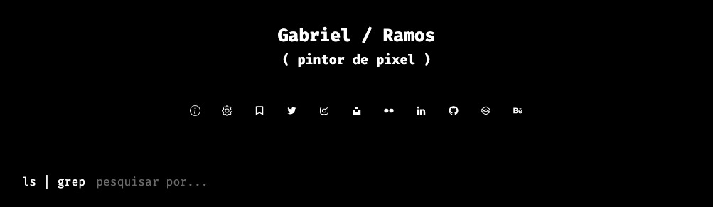

# [gabrieluizramos.com.br](https://gabrieluizramos.com.br/)

Follows my personal [terminal](https://github.com/gabrieluizramos/dotfiles/blob/master/.dotfiles/symlinks/.zshrc#L16) and [editor](https://www.nordtheme.com/) color and theme.

## Folder structure
- [commands](./commands): some setup, draft creation/publishing and redate scripts;
- [config](./config): build and configuration files, such as [browser](./config/browser) and [plugins](./config/plugins) settings;
- [posts](./posts): all the blog posts, divided into the [draft](./posts/drafts) and [published](./posts/published) categories;
- [src](./src): application source files;
- [static](./static): static files preserved during build time.

### Built with
- [Gatsby](https://www.gatsbyjs.org/)
- [Styled components](https://styled-components.com/)
